<div align="center">
  
<!-- Animated Header -->


<!-- Typing Animation -->
<p align="center">
  
</p>

<!-- Social Badges -->
<p align="center">
  <a href="https://www.linkedin.com/in/harsh-soni-data-analyst">
    
  </a>
  <a href="mailto:your-email@example.com">
    
  </a>
  <a href="https://github.com/data-analyst-harsh-soni">
    
  </a>
  <a href="https://github.com/data-analyst-harsh-soni">
    
  </a>
</p>

</div>

---

## 🎯 About Me

```python
class DataAnalyst:
    def __init__(self):
        self.name = "Harsh Soni"
        self.location = "Jabalpur, Madhya Pradesh, India 🇮🇳"
        self.education = "B.Tech in Computer Science Engineering"
        self.role = "Aspiring Data Analyst"
        self.passion = "Transforming Raw Data into Actionable Insights"
        
    def current_focus(self):
        return [
            "Building Interactive Power BI Dashboards 📊",
            "Mastering Advanced SQL Queries 🗄️",
            "Exploring Machine Learning Algorithms 🤖",
            "Creating Data-Driven Solutions 💡"
        ]
    
    def philosophy(self):
        return "Bridging the gap between code and business strategy"

harsh = DataAnalyst()
print(harsh.philosophy())
# Output: "Bridging the gap between code and business strategy"
```

<div align="center">
  
### 💡 Current Focus
  
**🔭 Working on:** Advanced Power BI Dashboards & Real-World Data Projects  
**🌱 Learning:** Advanced SQL, Machine Learning, Statistical Analysis  
**💬 Ask me about:** Excel Magic, Python for Data Analysis, Power BI Visualizations  
**⚡ Fun fact:** I combine Data Analytics with Solar Energy Technology!

</div>

---

## 🛠️ Tech Stack & Tools

<div align="center">

### 📊 Data Analysis & Visualization


### 🗄️ Databases


### 💻 Development


### 🔧 Tools & Platforms


</div>

---

## 🎨 Featured Projects

<div align="center">

<table>
<tr>
<td width="50%">

### 🏪 Retail Analytics Dashboard
[](https://github.com/data-analyst-harsh-soni/Retail-Analytics-Dashboard-using-Microsoft-Excel)


**Interactive Excel dashboard analyzing customer behavior & sales trends**

🔹 **Tech:** Excel, Pivot Tables, Slicers, Charts  
🔹 **Impact:** Identified peak sales seasons & profitable payment methods  
🔹 **Insight:** Credit Card payments drove highest profitability  


</td>
<td width="50%">

### 🌞 Solar For All Platform
[](https://github.com/data-analyst-harsh-soni/SOLAR)


**Web platform promoting solar energy adoption with AI integration**

🔹 **Tech:** HTML, CSS, JavaScript, Vercel  
🔹 **Achievement:** NASA Space Apps Challenge 2025  
🔹 **Features:** Solar Calculator, Cost Estimator, AI Chatbot  


</td>
</tr>

<tr>
<td width="50%">

### 🧹 Data Cleaning & Visualization
[](https://github.com/data-analyst-harsh-soni/Data-Cleaning-Visualization-Project-using-Python-Real-World-Data-from-Web-Source-)


**Real-world data cleaning & visualization using Python**

🔹 **Tech:** Python, Pandas, Matplotlib, NumPy  
🔹 **Process:** Data Scraping → Cleaning → Analysis → Visualization  
🔹 **Skills:** Missing Value Handling, Outlier Detection, EDA  


</td>
<td width="50%">

### 🔐 UIDAI Aadhaar Analytics
[](https://github.com/data-analyst-harsh-soni/UIDAI-Aadhaar-Enrollment-Analysis-Dashboard)


**Government data analysis visualizing enrollment trends**

🔹 **Tech:** Power BI, DAX, Data Modeling  
🔹 **Data Source:** Official UIDAI Government Dataset  
🔹 **Insights:** State-wise enrollment patterns & demographics  


</td>
</tr>

<tr>
<td width="50%">

### 💊 Healthcare Power BI Dashboard
[](https://github.com/data-analyst-harsh-soni/Healthcare-PowerBI-Dashboard)


**Hospital performance & patient analytics dashboard**

🔹 **Tech:** Power BI, Healthcare Metrics  
🔹 **Features:** Patient Flow, Wait Times, Department Performance  
🔹 **Impact:** Data-driven healthcare insights  


</td>
<td width="50%">

### 📈 Sales Intelligence Dashboard
[](https://github.com/data-analyst-harsh-soni/Enterprise-Sales-Intelligence)


**Enterprise sales performance tracking & forecasting**

🔹 **Tech:** Power BI, SQL, Excel  
🔹 **Metrics:** Revenue Trends, Sales Targets, Regional Analysis  
🔹 **Value:** Predictive insights for sales strategy  


</td>
</tr>

<tr>
<td width="50%">

### 🌐 Python Web Traffic Analysis
[](https://github.com/data-analyst-harsh-soni/Python-Web-Traffic-Analysis)


**Analyzing website traffic patterns using Python**

🔹 **Tech:** Python, Pandas, Data Visualization  
🔹 **Analysis:** User behavior, Traffic sources, Page performance  
🔹 **Output:** Actionable web optimization insights  


</td>
<td width="50%">

### 🔮 More Projects Coming Soon!
[](https://github.com/data-analyst-harsh-soni?tab=repositories)


**Continuously building and learning!**

🔹 Advanced ML Models  
🔹 Real-time Data Pipelines  
🔹 Interactive Dashboards  
🔹 ETL Automation Projects  

</td>
</tr>

</table>

</div>

---

## 📊 GitHub Analytics

<div align="center">
  


</div>

<div align="center">
  


</div>

<div align="center">
  


</div>


---

## 💼 Professional Journey

```mermaid
graph LR
    A[🎓 B.Tech CSE Student] --> B[📚 Learning Data Analytics]
    B --> C[💻 Building Projects]
    C --> D[📊 Creating Dashboards]
    D --> E[🚀 Aspiring Data Analyst]
    E --> F[🎯 Future Data Professional]
    
    style A fill:#3b82f6
    style B fill:#8b5cf6
    style C fill:#ec4899
    style D fill:#f59e0b
    style E fill:#10b981
    style F fill:#06b6d4
```



---

## 🎯 Skills Breakdown

<div align="center">

| 🔍 Skill Category | 💪 Proficiency | 📚 Tools |
|:------------------|:--------------:|:---------|
| **Data Analysis** | ⭐⭐⭐⭐⭐ | Python, Pandas, NumPy, Excel |
| **Data Visualization** | ⭐⭐⭐⭐⭐ | Power BI, Matplotlib, Seaborn |
| **Database Management** | ⭐⭐⭐⭐ | MySQL, SQL Server, PostgreSQL |
| **Statistical Analysis** | ⭐⭐⭐⭐ | Hypothesis Testing, A/B Testing |
| **Web Development** | ⭐⭐⭐ | HTML, CSS, JavaScript |
| **Machine Learning** | ⭐⭐⭐ | Scikit-learn, Basic ML Models |

</div>

---

## 🌟 Key Achievements

<div align="center">

```
┌──────────────────────────────────────────────────────────────┐
│  🏆  NASA Space Apps Challenge 2025 Participant              │
│  📊  10+ Data Analysis Projects Completed                    │
│  💼  Created 5+ Interactive Power BI Dashboards              │
│  🎓  B.Tech in Computer Science Engineering                  │
│  🚀  Continuous Learner & Problem Solver                     │
└──────────────────────────────────────────────────────────────┘
```

</div>

---

## 💭 Quote of the Day

<div align="center">


</div>

---

## 📫 Let's Connect!

<div align="center">

I'm always excited to connect with fellow data enthusiasts, developers, and learners!  
Feel free to reach out for collaborations, discussions, or just to say hi! 👋

<table>
  <tr>
    <td align="center" width="25%">
      <a href="https://www.linkedin.com/in/harsh-soni-data-analyst">
        
        <br><b>LinkedIn</b>
      </a>
    </td>
    <td align="center" width="25%">
      <a href="mailto:your-email@example.com">
        
        <br><b>Email</b>
      </a>
    </td>
    <td align="center" width="25%">
      <a href="https://github.com/data-analyst-harsh-soni">
        
        <br><b>GitHub</b>
      </a>
    </td>
    <td align="center" width="25%">
      <a href="https://github.com/data-analyst-harsh-soni?tab=repositories">
        
        <br><b>Projects</b>
      </a>
    </td>
  </tr>
</table>

### ⚡ Quick Facts

```python
fun_facts = {
    "🌍 Location": "Jabalpur, Madhya Pradesh, India",
    "🎯 Focus": "Data Analytics & Business Intelligence",
    "💡 Passion": "Turning data into stories",
    "🔬 Interest": "Solar Energy Technology",
    "☕ Fuel": "Coffee & Data Visualizations",
    "🎮 Hobby": "Problem Solving & Coding"
}
```

</div>

---

<div align="center">

### 📊 "Data is the new oil. It's valuable, but if unrefined, it cannot really be used."

**💙 Thanks for visiting my profile! Let's turn data into insights together!**


---

<sub>⭐️ From [Harsh Soni](https://github.com/data-analyst-harsh-soni) with 💙</sub>

</div>
